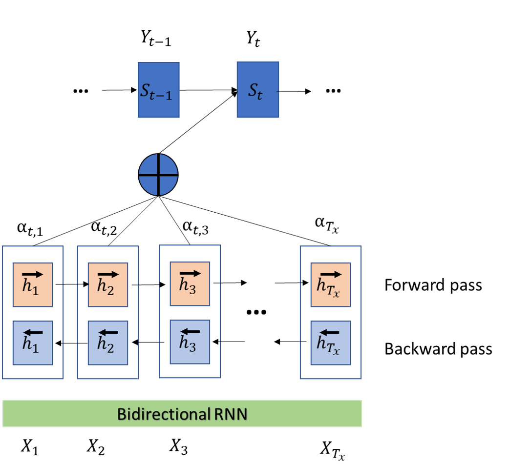

<h1> NEURAL MACHINE TRANSLATION BY JOINTLY LEARNING TO ALIGN AND TRANSLATE </h1>

<h3> Contexte: </h3>

Ce projet propose une explication simple mais surtout en français du papier "NEURAL MACHINE TRANSLATION BY JOINTLY LEARNING TO ALIGN AND TRANSLATE" de Dzmitry BAHDANAU, Kyung Hyun CHO et de Yoshua BENGIO. Il apporte aussi une implémentation de ce papier en adaptant une version pytorch revisitée du tutoriel sur la traduction automatique (de textes espagnol vers des textes en anglais de tensorflow) à l'aide de réseau de neurones. Vous pouvez trouver la version originale du tutoriel <a href="https://www.tensorflow.org/tutorials/text/nmt_with_attention">ici</a>. Quant au papier vous pouvez le trouver <a href="https://arxiv.org/abs/1409.0473">ici</a>.

<h3> Ce que vous pouvez retenir du papier: </h3>

La traduction automatique de textes grâce à des réseaux de neurones (Natural Machine Translation en anglais ou NMT en abrégé) est une approche de plus en plus en vogue. Son but est de permettre d'obtenir une traduction de qualité avec un seul composant (grand réseau de neurones) qui lit à la fois le texte d'entrée et le traduit dans la langue d'arrivée. Ce qui se différencie de la traduction statistique traditionnelle. 

Le papier propose une architecture performante de réseau de neurones dite: encodeur-attention-décodeur qui permet lors de la traduction d'un mot de se focaliser sur les groupes de mots dans la séquence d'entrée les plus importants définissant un contexte pour le mot à traduire. Ce méchanisme est appelé méchanisme d'attention et permet d'obtenir des performances remarquables même en présence de très longues phrases à traduire.

Supposons que nous avons une séquence en espagnol (phrase source) que nous voulons traduire vers l'anglais(phrase cible). Dans les architectures traditionnelles d'encodeur-décodeur précédent ce papier, l'encodeur lit la phrase source qui est représentée mathématiquement comme la séquence

avec

étant la longueur de la phrase (le nombre de mots). Et la représente en un contexte C. Généralement on utilise un RNN (réseau de neurone récurrent) qui produit les sorties:
 et le contexte:
 
f et q sont des fonctions non-linéaires telles que:  
 et .

 

Le décodeur quant à lui est entrainé pour prédire le prochain mot  connaissant le vecteur contexte C et et tous les mots déja prédits . En d'autres termes la phrase cible est modélisée par une probabilité jointe sur tous ses mots qui peut s'écrire: 

où  .

Avec un RNN dans le décodeur on modélise chaque probabilté conditionnelle comme :  (le mot qui vient d'être prédit, les états cachés correspondant au mot à prédire et tout le vecteur contexte C). La fonction g est non linéaire délivrant la probabilié  et  étant l'état caché du RNN.

Le papier est innovant en ce qu'il propose de définir chaque probabilité conditionnelle comme  :  où  est désormais un vecteur contexte dynamique (donc non statique comme précédemment) et dépendant du mot  à prédire.

<h4> L'encodeur: </h4>

L'encodeur est simplement un RNN bdirectionnel même si nous utiliserons un RNN à une seule direction dans ce projet. Cet encodeur "mappe" une séquence d'entrée  en une séquence d'annotations  bidirectionnelle. Et chaque  est obtenu par concaténation du forward pass et du bacward pass du RNN et contient de l'information sur toute la séquence avec un grand focus sur le i-ème élément de la séquence d'entrée.
  

<h4> Le décodeur avec méchanisme d'attention: </h4>

Les équations suivantes sont computées :  où "a" est une fonction d'attention qui score comment les inputs autour du j-ème élément de la séquence d'entrée et l'output de la position i matchent.  est l'état caché du RNN avant d'émettre   .

Les auteurs ont choisi un MLP pour des raisons de computation car le modèle est évalué  pour chaque paire phrase source - phrase cible.

 

Pour le décodeur on passe en pratique la concaténation de  et de  a un RNN (GRU) dont l'état est  pour prédire .

Selon le papier ils ont ensuite passé la sortie du RNN à une couche de maxout units puis normaliser avec un softmax pour avoir les probabilités sur l'espace défini par le vocabulaire de la langue d'arrivée.

Le maxout modèle est simplement une architecture feed-forward (comme un MLP) qui utilise une fonction d'activation  appelée maxout unit. Etant donnée une entrée  on compute  (ce qui revient à passer X dans une couche dense !) puis on applique la fonction d'activation appelée maxout unit:

Ian GOODFELLOW et Yoshua BENGIO ont démontré que c'est un approximateur universel. Mais l'incovénient est qu'il double le nombre de paramètres donc j'utiliserai plutôt une Relu à la place.

  

